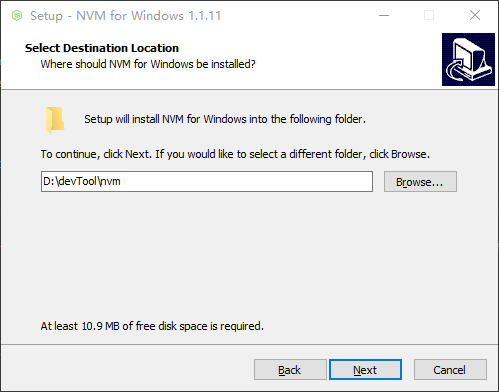
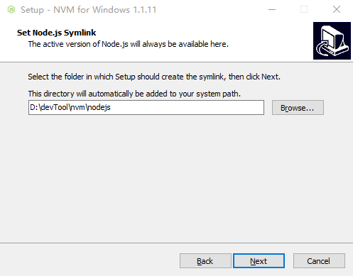
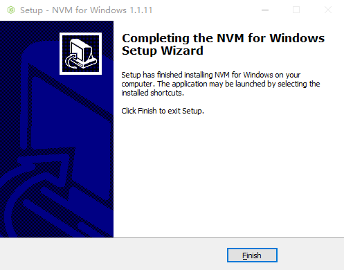

### 什么是 NVM

[](https://github.com/nvm-sh/nvm)

nvm 全称 Node Version Manager，是一种 nodejs 版本管理工具，它允许我们只通过简单的命令行实现“快速”安装和使用不同版本的 nodejs。

```cmd title=命令行示例
$ nvm use 16
Now using node v16.9.1 (npm v7.21.1)
$ node -v
v16.9.1
$ nvm use 14
Now using node v14.18.0 (npm v6.14.15)
$ node -v
v14.18.0
$ nvm install 12
Now using node v12.22.6 (npm v6.14.5)
$ node -v
v12.22.6
```

<!--truncate-->

### NVM 安装

当前只记录 Windows 环境下的安装教程，其他平台的参照 [Installing and Updating](https://github.com/nvm-sh/nvm#installing-and-updating)。

访问 [nvm-windows](https://github.com/coreybutler/nvm-windows/releases) 仓库，下载指定版本的 `nvm-setup.exe` 安装包点击安装即可。




### NVM 常见命令使用

nvm 帮助文档

```
nvm
```

输出的帮助文档如下：

Running version 1.1.7.

| Usage &nbsp;&nbsp;&nbsp;&nbsp;&nbsp;&nbsp;&nbsp;&nbsp;&nbsp;&nbsp;&nbsp;&nbsp;&nbsp;&nbsp;&nbsp;&nbsp;&nbsp;&nbsp;&nbsp;&nbsp;&nbsp;&nbsp;&nbsp;&nbsp;&nbsp;&nbsp;&nbsp;&nbsp;&nbsp;&nbsp;&nbsp;&nbsp;&nbsp;&nbsp;&nbsp;&nbsp;&nbsp;&nbsp;&nbsp;&nbsp;&nbsp;&nbsp;&nbsp;&nbsp;&nbsp;&nbsp;&nbsp;&nbsp;&nbsp;&nbsp; | Description                                                                                                                                                                                                                                                                                                                        |
| ------------------------------------------------------------------------------------------------------------------------------------------------------------------------------------------------------------------------------------------------------------------------------------------------------------------ | ---------------------------------------------------------------------------------------------------------------------------------------------------------------------------------------------------------------------------------------------------------------------------------------------------------------------------------- |
| `vm arch`                                                                                                                                                                                                                                                                                                          | `Show if node is running in 32 or 64 bit mode.`                                                                                                                                                                                                                                                                                    |
| `nvm install <version> [arch]`                                                                                                                                                                                                                                                                                     | `The version can be a node.js version or "latest" for the latest stable version. Optionally specify whether to install the 32 or 64 bit version (defaults to system arch).Set [arch] to "all" to install 32 AND 64 bit versions.Add --insecure to the end of this command to bypass SSL validation of the remote download server.` |
| `nvm list [available]`                                                                                                                                                                                                                                                                                             | `List the node.js installations. Type "available" at the end to see what can be installed. Aliased as ls.`                                                                                                                                                                                                                         |
| `nvm on`                                                                                                                                                                                                                                                                                                           | `Enable node.js version management.`                                                                                                                                                                                                                                                                                               |
| `nvm off`                                                                                                                                                                                                                                                                                                          | `Disable node.js version management.`                                                                                                                                                                                                                                                                                              |
| `nvm proxy [url]`                                                                                                                                                                                                                                                                                                  | `Set a proxy to use for downloads. Leave [url] blank to see the current proxy.Set [url] to "none" to remove the proxy.`                                                                                                                                                                                                            |
| `nvm node_mirror [url]`                                                                                                                                                                                                                                                                                            | `Set the node mirror. Defaults to https://nodejs.org/dist/. Leave [url] blank to use default url.`                                                                                                                                                                                                                                 |
| `nvm npm_mirror [url]`                                                                                                                                                                                                                                                                                             | `Set the npm mirror. Defaults to https://github.com/npm/cli/archive/. Leave [url] blank to default url.`                                                                                                                                                                                                                           |
| `nvm uninstall <version>`                                                                                                                                                                                                                                                                                          | `The version must be a specific version.`                                                                                                                                                                                                                                                                                          |
| `nvm use [version] [arch]`                                                                                                                                                                                                                                                                                         | `Switch to use the specified version. Optionally specify 32/64bit architecture.nvm use <arch> will continue using the selected version, but switch to 32/64 bit mode.`                                                                                                                                                             |
| `nvm root [path]`                                                                                                                                                                                                                                                                                                  | `Set the directory where nvm should store different versions of node.js.If <path> is not set, the current root will be displayed.`                                                                                                                                                                                                 |
| `nvm version`                                                                                                                                                                                                                                                                                                      | `Displays the current running version of nvm for Windows. Aliased as v.`                                                                                                                                                                                                                                                           |

查看当前远程镜像仓库中可用的 node 版本

```
nvm list available
```

> 如果遇到如下错误可重新运行一次`nvm list available`

```
Could not retrieve https://npmmirror.com/mirrors/node/index.json.

Get "https://cdn.npmmirror.com/binaries/node/index.json": read tcp 10.106.22.43:52214->111.39.146.89:443: wsarecv: An existing connection was forcibly closed by the remote host.
```

输出结果如下：

| CURRENT | LTS     | OLD STABLE | OLD UNSTABLE |
| ------- | ------- | ---------- | ------------ |
| 20.6.0  | 18.17.1 | 0.12.18    | 0.11.16      |
| 20.5.1  | 18.17.0 | 0.12.17    | 0.11.15      |
| 20.5.0  | 18.16.1 | 0.12.16    | 0.11.14      |
| 20.4.0  | 18.16.0 | 0.12.15    | 0.11.13      |
| 20.3.1  | 18.15.0 | 0.12.14    | 0.11.12      |
| 20.3.0  | 18.14.2 | 0.12.13    | 0.11.11      |
| 20.2.0  | 18.14.1 | 0.12.12    | 0.11.10      |
| 20.1.0  | 18.14.0 | 0.12.11    | 0.11.9       |
| 20.0.0  | 18.13.0 | 0.12.10    | 0.11.8       |
| 19.9.0  | 18.12.1 | 0.12.9     | 0.11.7       |
| 19.8.1  | 18.12.0 | 0.12.8     | 0.11.6       |
| 19.8.0  | 16.20.2 | 0.12.7     | 0.11.5       |
| 19.7.0  | 16.20.1 | 0.12.6     | 0.11.4       |
| 19.6.1  | 16.20.0 | 0.12.5     | 0.11.3       |
| 19.6.0  | 16.19.1 | 0.12.4     | 0.11.2       |
| 19.5.0  | 16.19.0 | 0.12.3     | 0.11.1       |
| 19.4.0  | 16.18.1 | 0.12.2     | 0.11.0       |
| 19.3.0  | 16.18.0 | 0.12.1     | 0.9.12       |
| 19.2.0  | 16.17.1 | 0.12.0     | 0.9.11       |
| 19.1.0  | 16.17.0 | 0.10.48    | 0.9.10       |

This is a partial list. For a complete list, visit https://nodejs.org/en/download/releases

下载、编译并安装**指定**版本的 node

```cmd
nvm install 18.17.1
```

输出可能如下：

```
Downloading node.js version 18.17.1 (64-bit)...
Extracting node and npm...
Complete
npm v9.6.7 installed successfully.


Installation complete. If you want to use this version, type

nvm use 18.17.1
```

选择当前使用的 node 版本

```
nvm use 18.17.1
```

输入如下：

```
Now using node v18.17.1 (64-bit)
```

查看本地已经安装的可用 node 版本

```
nvm list
```

输出结果可能如下：

```
* 18.17.1 (Currently using 64-bit executable)
  16.17.0
```

### 修改 NVM 镜像路径

1. 方式一：

直接修改 nvm 安装目录下 `setting.txt`文件

修改前：

```
root: D:\devTool\nvm
path: D:\devTool\nvm\nodejs
```

修改后：

```
root: D:\devTool\nvm
path: D:\devTool\nvm\nodejs
node_mirror: https://npmmirror.com/mirrors/node/
npm_mirror: https://npmmirror.com/mirrors/npm/
```

1. 方式二：

命令行修改

```
nvm node_mirror https://npmmirror.com/mirrors/node/
nvm npm_mirror https://npmmirror.com/mirrors/npm/
```

### NVM 问题补充

待补充
