## 环境安装

### Linux 安装

1. 安装最新版本 rust

   ```
   curl --proto '=https' --tlsv1.2 https://sh.rustup.rs -sSf | sh
   ```

   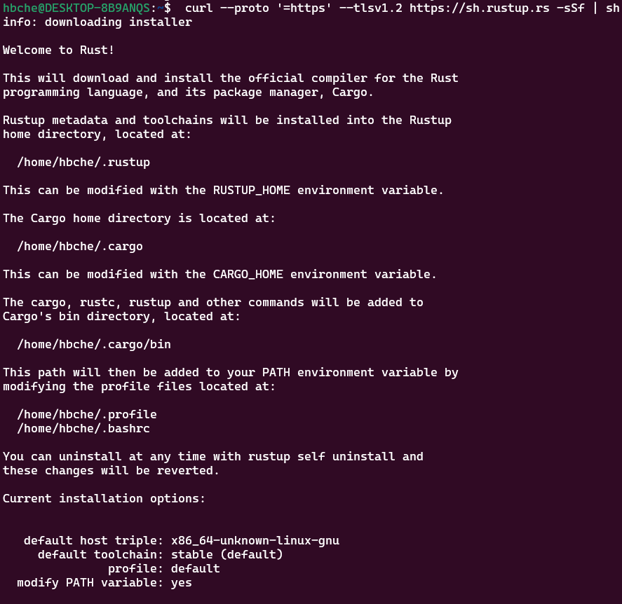
   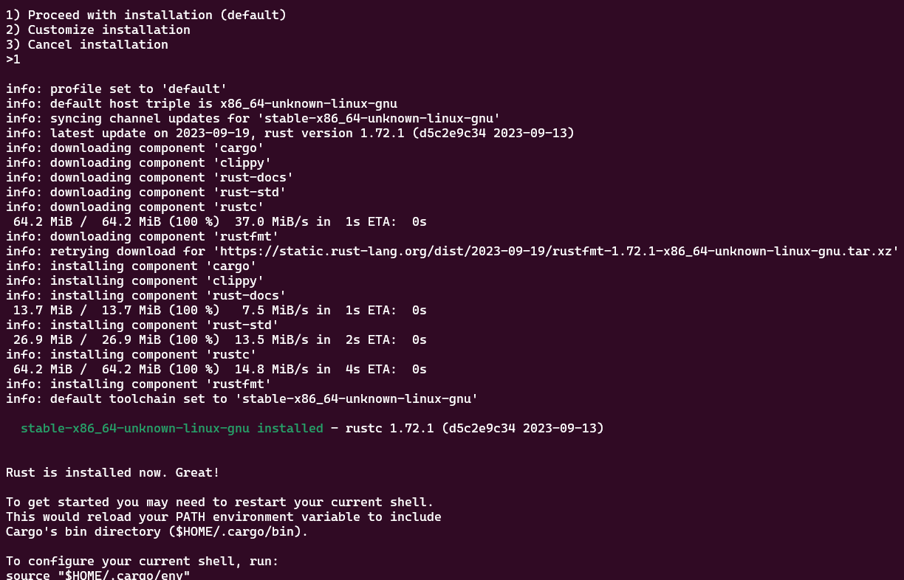

   Ubuntu 或者 Debian 也可以使用以下命令进行安装

   ```
   sudo apt install rust
   ```

2. 如果当前 Linux 缺少 `cc` linker，在使用 `rustc` 程序时会报错

   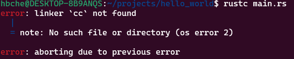

   安装 `cc` linker

   ```
   sudo apt install build-essential
   ```

3. 检查 `rustc` 和 `rustup` 命令是否可用，使用 `rustup` 对 rust 进行更新

   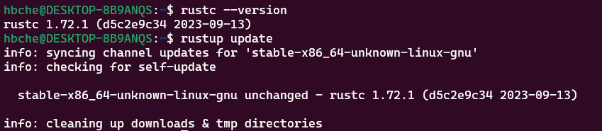

4. 卸载 rust

   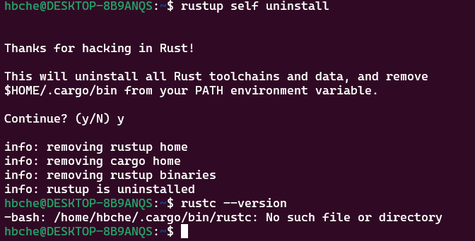

<!--truncate-->

### Windows 安装

[参照官方教程](https://rust-lang.github.io/rustup/installation/windows-msvc.html)

1. 下载 rust 安装程序并安装

   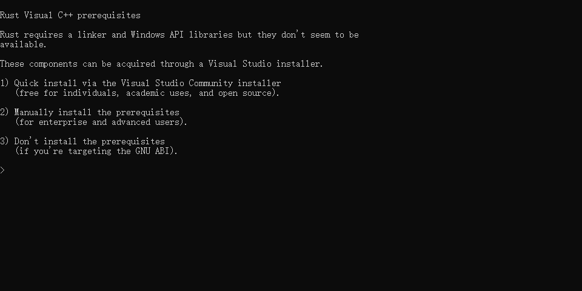

2. 此时 rust 会检测当前环境是否满足 rust 安装程序的要求，如果不满足，会提示用户安装对应的程序

   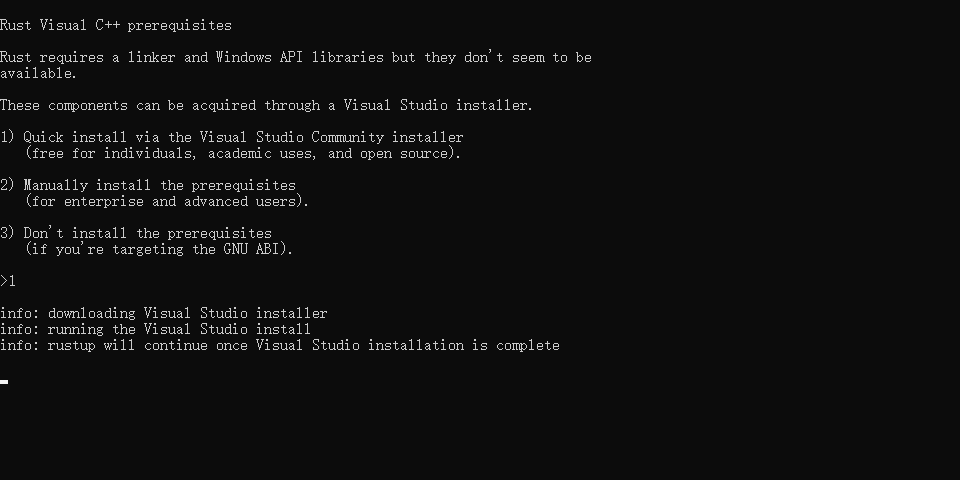

3. 我们选择方案 1，此时会拉起 `Visual Studio Installer` 安装程序，我们直接点击确定进行安装

   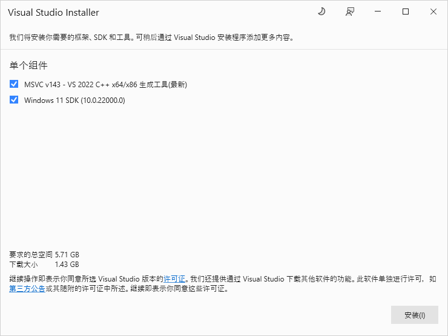

4. 安装完之后需要重启电脑，重启成功之后，我们重新点击 rust 安装程序进行安装，此时检测到的安装环境将满足 rust 安装程序的要求

   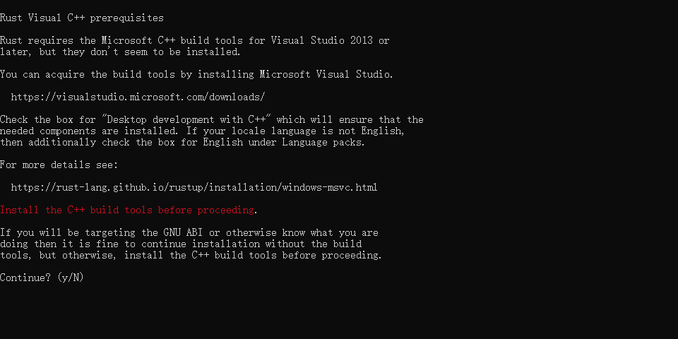

   > 如果看到提示未安装 C++ 构建工具时，需要停止安装，下载安装 Visual Studio 2017 或更高版本，具体安装详见[官方 Windows 平台安装的文档](https://rust-lang.github.io/rustup/installation/windows-msvc.html)

5. 下载 最新版本的 Visual Studio ，点击安装，安装时选择 `Desktop Development with C++`，安装过程较长，且部分包需要 VPN 才能下载，安装成功后再回头执行 Rust 安装程序就不会看到未安装 `C++ Build Tools` 的提示了

   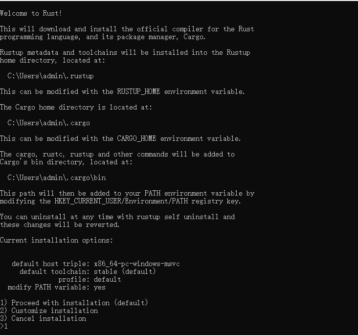

6. rust 安装程序会提示选择哪种安装方式

   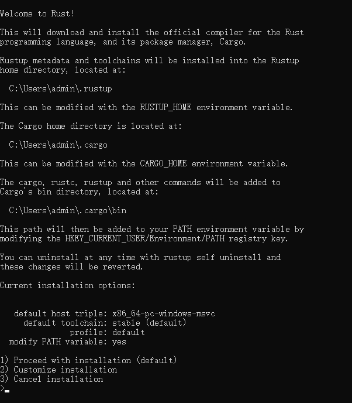

7. 我们选择方式 1 进行安装，安装结束后提示按回车键结束

   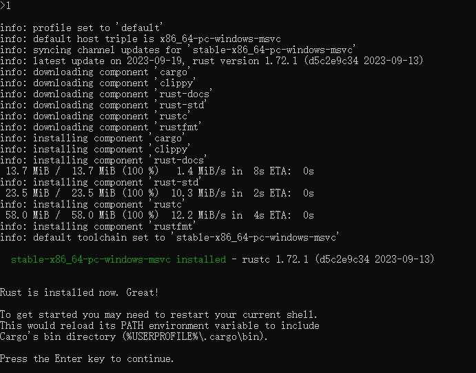

8. 重新打开 cmd，检查 rustc 和 rustup 是否可用

   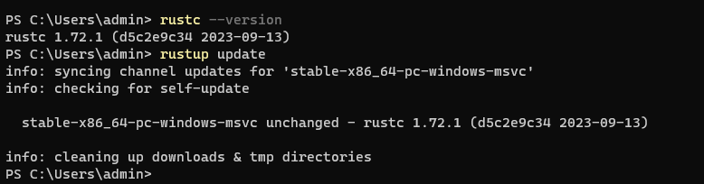

至此，rust 安装程序就成功了 φ(\*￣ 0 ￣)可以开启 rust 之旅了( •̀ ω •́ )✧

## 参考

[Rust 程序设计语言](https://rustwiki.org/zh-CN/book/title-page.html)
