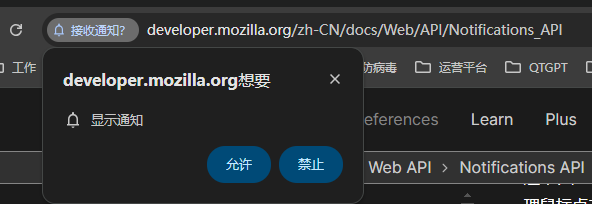

## 指南

Notifications API 允许网页控制向最终用户显示系统通知——这些都在顶层浏览上下文窗口
之外，因此即使用户已经切换标签页或移动到不同的应用程序也可以显示。该 API 被设计
成与不同平台上的现有通知系统兼容。

### 概念和用法

在受支持的平台上，显示系统通知通常涉及两件事。首先，用户需要授予当前来源显示系统
通知的权限，这通常在应用或网站初始化时使用 Notification.requestPermission() 方法
完成。仅应在处理用户手势（例如处理鼠标点击时）时调用此方法。

```js
btn.addEventListener('click', () => {
  let promise = Notification.requestPermission();
});
```

这将产生一个对话框，内容如下：



从这里，用户可以选择允许来自此来源的通知或阻止来自此来源的通知。一旦做出选择，该
设置通常将持续用于当前会话。

接下来，使用 `Notification()` 构造方法创建一个新通知。这个函数必须传递一个标题参
数，并且可以选择传递一个选项对象来指定选项，例如文本方向、正文、要显示的图标、要
播放的通知的声音等等。

此外，Notifications API 规范对
[ServiceWorker API](https://developer.mozilla.org/zh-CN/docs/Web/API/Service_Worker_API)
指定了多个扩展，以允许 Service Worker 发送通知。

## 接口

## 方法

## 事件

## 示例
